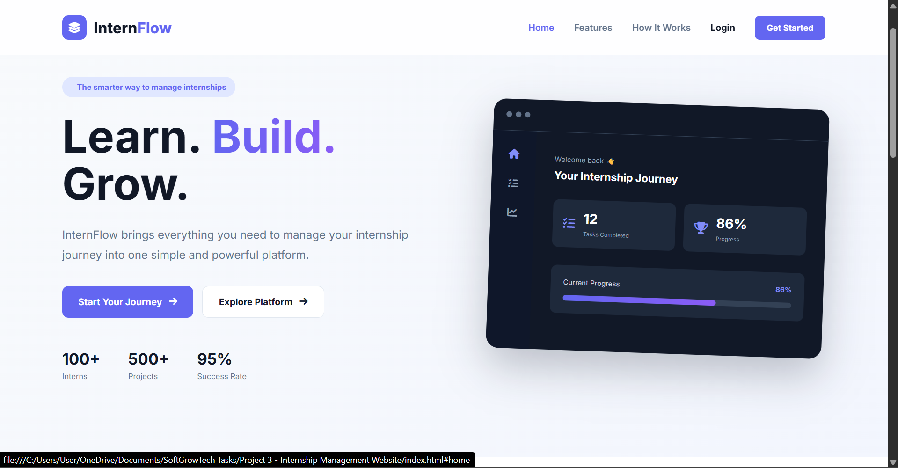
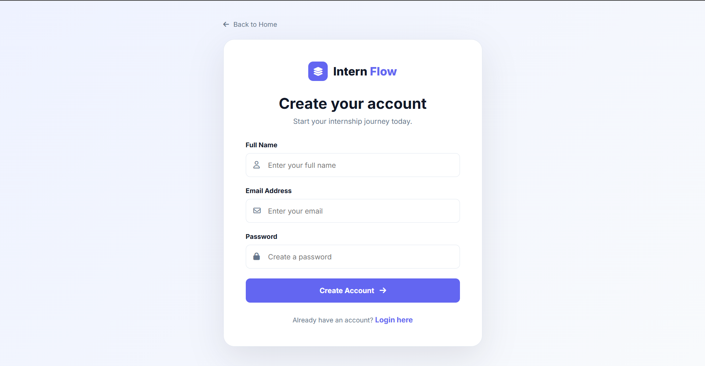
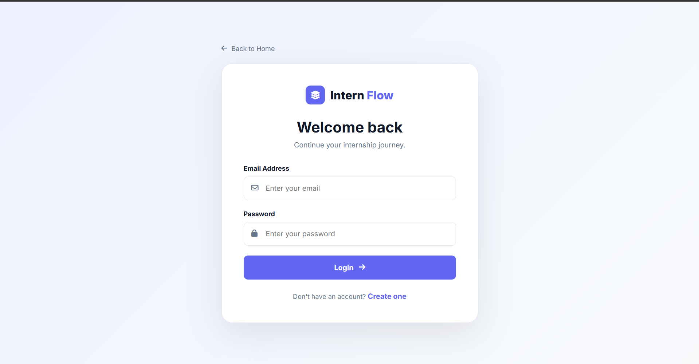
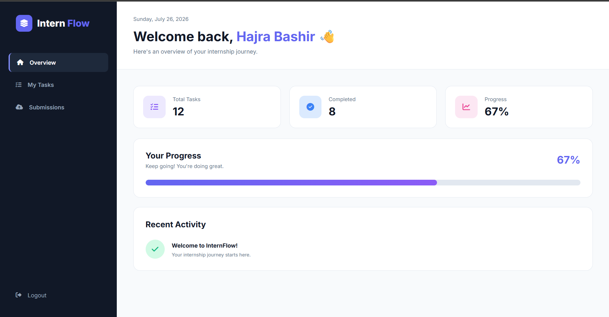
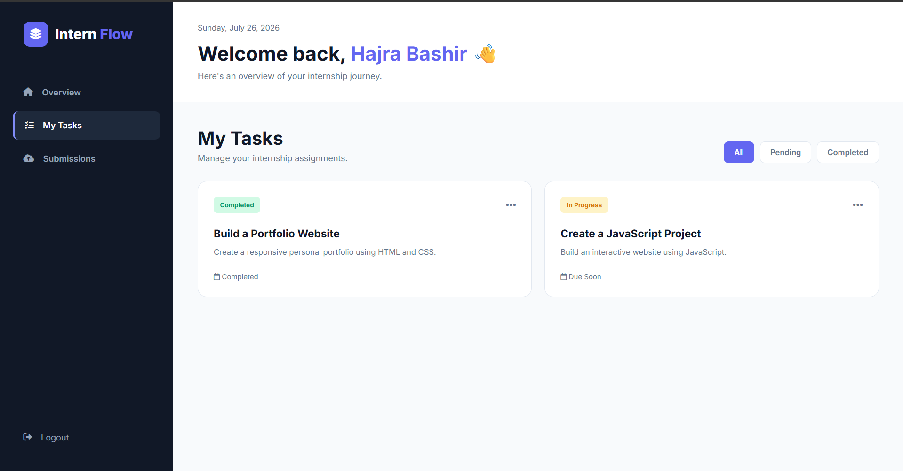
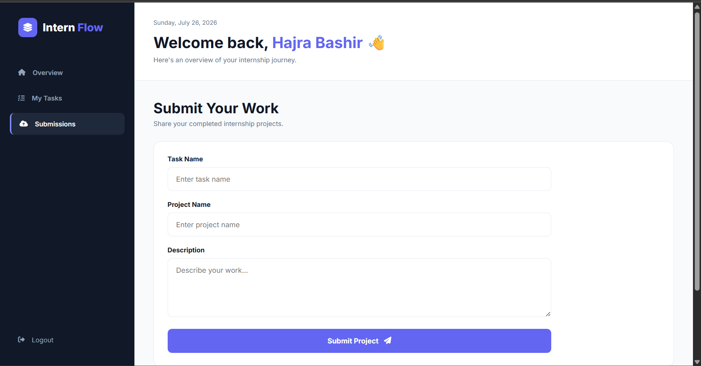

# InternFlow

### Internship Management & Progress Tracking Platform

InternFlow is a responsive web-based internship management platform designed to help interns organize their internship journey, manage tasks, track progress, and submit projects through a simple and interactive interface.

This project was developed as my final internship project during my internship at SoftGrowTech.

---

## 🌐 Live Demo

View Live Demo: https://hajra-code.github.io/Internship-Management-Website/ 

---

## ✨ Features

- 👤 User registration and login
- 🏠 Personalized intern dashboard
- 📋 Task management
- 🔍 Task filtering by status
- 📊 Internship progress tracking
- 📤 Project submission system
- 💾 Browser-based data storage using LocalStorage
- 🚪 Logout functionality
- 📱 Responsive design for different screen sizes
- 🎨 Modern and user-friendly interface

---

## 🛠️ Technologies Used

- HTML5
- CSS3
- JavaScript
- Font Awesome
- Google Fonts
- Browser LocalStorage

---

## 📸 Screenshots

### 🏠 Homepage

---

### 📝 Registration Page

---

### 🔐 Login Page

---

### 📊 Intern Dashboard

---

### 📋 Task Management

---

### 📤 Project Submission

---

## ⚙️ How to Run

1. Clone the repository.

2. Open the project folder.

3. Open index.html in your browser.

No backend or installation is required.

---

## 💡 How It Works

Users can create an account and log in to access their internship dashboard.

After logging in, interns can:

- View their internship progress
- Check assigned tasks
- Filter tasks according to their status
- Submit their completed projects
- View their submissions

User account information and project submissions are stored in the browser using JavaScript's Local Storage.

---

## 📚 Learning Outcomes

- Structuring web pages using semantic HTML5
- Creating responsive and modern user interfaces with CSS3
- Using JavaScript for interactive functionality and dynamic content
- Implementing form validation and user authentication logic
- Working with browser LocalStorage for storing user data and submissions
- Building dashboard interfaces and task management features
- Improving problem-solving and debugging skills
- Understanding the process of developing a complete frontend web project

---

## 🚀 Future Improvements

- Backend integration with a real database
- Secure user authentication and password encryption
- Separate accounts for interns and supervisors
- Real-time task assignment and progress updates
- File upload functionality for project submissions
- Email notifications and reminders
- Internship certificates and completion tracking
- Admin dashboard for managing interns and tasks
- Cloud-based data storage
- Advanced analytics and progress reports

---

## 🎯 Project Purpose

The purpose of InternFlow is to provide interns with a centralized platform where they can organize their tasks, monitor their progress, and manage their internship-related submissions.

---

## 👩‍💻 Author

**Hajra Bashir**

Developed as the final project of my internship at **SoftGrowTech**.

🔗 [See Me On LinkedIn!](https://www.linkedin.com/in/hajra-bashir/)
